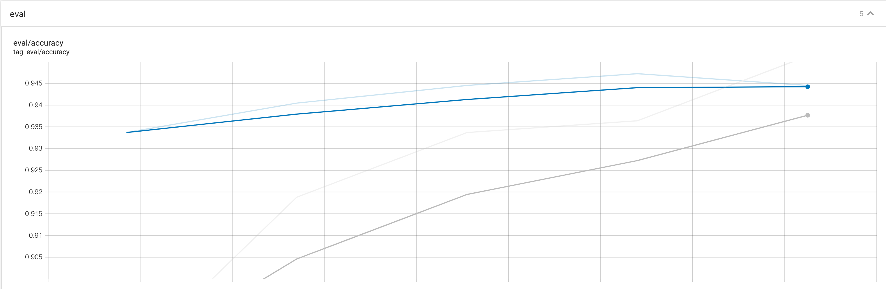
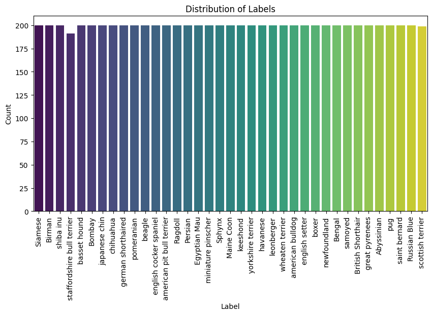
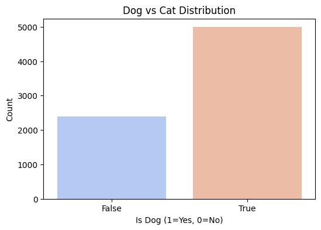
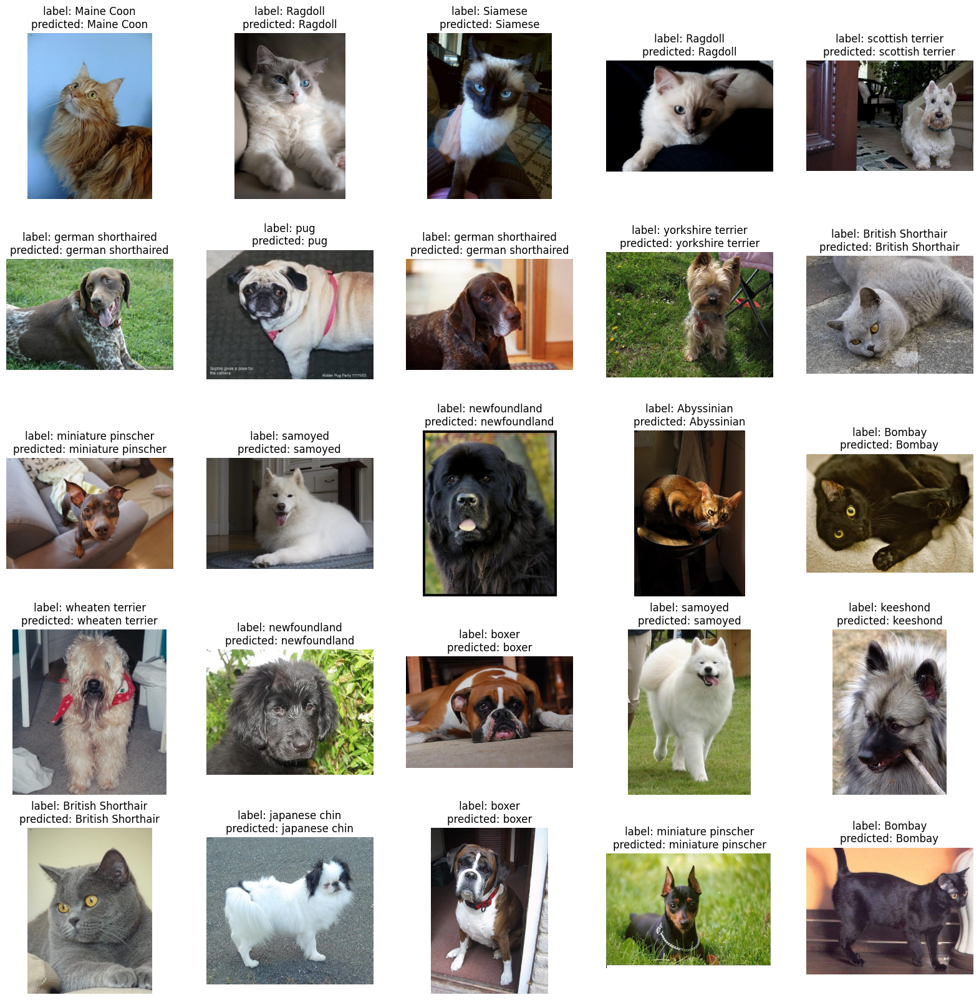

# Apartment Price Prediction

## Project Description
This project classifies different animal breeds.

### Name & URL
| Name          | URL |
|---------------|-----|
| Huggingface   | [Huggingface Space](https://huggingface.co/spaces/kuhs/ai-application-oxford-pets) |
| Model Page    | [Huggingface Model Page](https://huggingface.co/kuhs/vit-base-oxford-iiit-pets) |
| Code          | [GitHub Repository](https://github.com/bkuehnis/ai-application-oxford-pets) |

## Labels
The different breeds are:  
`['Siamese', 'Birman', 'shiba inu', 'staffordshire bull terrier', 'basset hound', 'Bombay', 'japanese chin', 'chihuahua', 'german shorthaired', 'pomeranian', 'beagle', 'english cocker spaniel', 'american pit bull terrier', 'Ragdoll', 'Persian', 'Egyptian Mau', 'miniature pinscher', 'Sphynx', 'Maine Coon', 'keeshond', 'yorkshire terrier', 'havanese', 'leonberger', 'wheaten terrier', 'american bulldog', 'english setter', 'boxer', 'newfoundland', 'Bengal', 'samoyed', 'British Shorthair', 'great pyrenees', 'Abyssinian', 'pug', 'saint bernard', 'Russian Blue', 'scottish terrier']`

## Data Sources and Features Used Per Source
| Data Source | Description |
|-------------|-------------|
| [Oxford-Pet](https://www.robots.ox.ac.uk/~vgg/data/pets/) | Original dataset from Oxford containing 37 breeds of pets. |
| Additional Test Data | 200 images were scraped from the internet and manually labeled. |

## Data Augmentation
| Augmentation                     | Description |
|-----------------------------------|-------------|
| `RandomHorizontalFlip()`          | Randomly flips the image horizontally with a probability of 0.5. |
| `RandomRotation(30)`              | Rotates the image randomly within a range of ±30 degrees. |
| `ColorJitter(brightness=0.2, contrast=0.2, saturation=0.2, hue=0.2)` | Randomly alters brightness, contrast, saturation, and hue within the specified limits. |
| `RandomResizedCrop(224)`          | Randomly crops and resizes the image to 224×224 pixels. |
| `RandomAffine(degrees=30, translate=(0.1, 0.1))` | Applies a random affine transformation, with rotation within ±30 degrees and translation up to 10% of the image dimensions. |

## Model Training

### Data Splitting Method (Train/Validation/Test)
A total of 7390 images from 37 breeds (200 images per breed) were used for training, validation, and testing, split as follows:  
80% for training, 10% for validation, and 10% for testing.

| Split      | Number of Rows |
|------------|---------------:|
| Train      | 5912          |
| Validation | 739           |
| Test       | 739           |

## Training

| Epoch | Training Loss | Validation Loss | Accuracy |
|-------|---------------|-----------------|----------|
| 1     | 0.373000      | 0.273244        | 93.37%   |
| 2     | 0.212700      | 0.214763        | 94.05%   |
| 3     | 0.180100      | 0.191792        | 94.45%   |
| 4     | 0.144800      | 0.185732        | 94.72%   |
| 5     | 0.130800      | 0.181368        | 94.45%   |

### TensorBoard

Details of training can be found at [Huggingface TensorBoard](https://huggingface.co/kuhs/vit-base-oxford-iiit-pets/tensorboard)

| Model/Method                                                         | TensorBoard Link                                      |
|----------------------------------------------------------------------|------------------------------------------------------|
| Transfer Learning with `google/vit-base-patch16-224` (without data augmentation) | runs/Feb07_17-31-08_clt-mob-w-2019                    |
| Transfer Learning with `google/vit-base-patch16-224` (with data augmentation)  | runs/Feb07_17-09-30_clt-mob-w-2019                    |

## Results
| Model/Method                                                         | Accuracy | Precision | Recall |
|----------------------------------------------------------------------|----------|-----------|--------|
| Transfer Learning with `google/vit-base-patch16-224` (without data augmentation) | 93%      | -         | -      |
| Transfer Learning with `google/vit-base-patch16-224` (with data augmentation)  | 95%      | -         | -      |
| Zero-shot Image Classification with `openai/clip-vit-large-patch14` | 88%      | 87.68%    | 88%    |

## References
  
  

