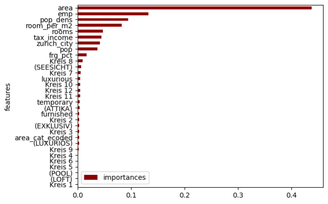

# Apartment Price Prediction

## Project Description
Predicts renting price of apartments in canton of Zurich. 

## Results
The model is still overfitting, more data may help to improve the performance of the model. The canton of Zurich has 160 political municipalities. With only 2344 data points, a municipality has an average of 14.65 data points. With more data, the location 

### Name & URL
| Name          | URL |
|--------------|----|
| Huggingface  | [Huggingface Space](https://huggingface.co/spaces/kuhs/apartment) |
| Code         | [GitHub Repository](https://github.com/bkuehnis/ai-application-apartment-prediction/tree/main) |

## Data Sources and Features Used Per Source
| Data Source | Features |
|-------------|----------|
| [Immoscout24](https://www.immoscout24.ch/) | bfs_number, rooms, area, price, postalcode, address, town, description_raw |
| [Wikipedia - Zurich Districts](https://de.wikipedia.org/wiki/Stadtteile_der_Stadt_Z%C3%BCrich) | residents per district |
| [Zurich District Borders](https://www.stadt-zuerich.ch/geodaten/download/Statistische_Quartiere) | district borders |
| [Swiss Atlas](https://www.atlas.bfs.admin.ch/maps/13/de/18055_75_3501_70/27876.html) | bfs_name, pop, pop_dens, frg_pct, emp, tax_income |
| [Swiss Geo API](https://api3.geo.admin.ch/services/sdiservices.html) | Latitude, longitude |

## Features Created
| Feature | Description |
|---------|-------------|
| room_per_m2 | Room / area |
| price_per_m2 | Price / area (not used!) |
| Luxurious, temporary, furnished | Extracted binary feature from description_raw if luxurious, temporary, furnished |
| area_cat, area_cat_encoded | Encoded area into three groups: 0: 0 – 49 m² 1: 50 – 99 m² 2: 100 – 500 m² |
| (LOFT), (POOL), (ATTIKA), (EXKLUSIV), (SEESICHT), (LUXURIÖS) | One hot encoding of feature Luxurious depending on type of luxurious |
| Kreis 1-12 | One hot encoding of apartments in the city Zurich |
| zurich_city | Binary feature if apartment is in the city Zurich |

## Model Training
### Amount of Data
- Total of 2344 apartments

### Data Splitting Method (Train/Validation/Test)
- First 80/20 Train/Test split then changed to cross-validation using 5 splits due to data limitations.

### Performance

| It. Nr | Model | Performance | Features | Description |
|--------|--------|-------------|------------|---------------|
| 1 | Linear Regression | Train: 0.56, Test: 0.42,  Train RMSE: 831, Test RMSE: 974 | `rooms, area, pop, pop_dens, frg_pct, emp, tax_income` | Underfitting |
| 2 | Random Forest | Train: 0.88, Test: 0.44,  Train RMSE: 428, Test RMSE: 964 | Same as It. 1 | Overfitting |
| 3 | Random Forest | Mean RMSE: -673.8 | Same as It. 1 | Underfitting |
| 4 | Random Forest | Mean RMSE: -136.2 | Added `room_per_m2, price_per_m2` | Used price_per_m2, making it unrealistic |
| 5 | Random Forest | Mean RMSE: -661.0 | Added `luxurious, temporary, furnished` | Underfitting |
| 6 | Random Forest | Mean RMSE: -660.4 | Added `area_cat_encoded` | Underfitting |
| 7 | Random Forest | Mean RMSE: -617.0 | `['rooms', 'area', 'pop', 'pop_dens', 'frg_pct', 'emp', 'tax_income', 'room_per_m2', 'luxurious', 'temporary', 'furnished', 'area_cat_ecoded', '(LUXURIÖS)',  '(POOL)', '(SEESICHT)',  '(EXKLUSIV)', '(ATTIKA)', '(LOFT)', 'Kreis 6', 'Kreis 11', 'Kreis 12', 'Kreis 10', 'Kreis 4', 'Kreis 1', 'Kreis 9', 'Kreis 5', 'Kreis 7', 'Kreis 3', 'Kreis 2', 'Kreis 8']` | Added one-hot encoded features for luxury types and Zurich districts   Underfitting, incorrect city Zurich data |
| 8 | Random Forest | Mean RMSE: -614.2 | Same as It. 7 | Fixed `pop` and `pop_dens` for Zurich city |
| 9 | Random Forest | Mean RMSE: -617.6 | `['rooms', 'area', 'pop', 'pop_dens', 'frg_pct', 'emp', 'tax_income', 'room_per_m2', 'luxurious', 'temporary', 'furnished', 'area_cat_ecoded', 'zurich_city']` | Reduced features after importance analysis   Still underfitting (see (#fig1)
| 10 | Random Forest | Mean RMSE: -612.6 | Same as It. 9 | Used GridSearch for best parameters |
| 11 | Random Forest | Train: 0.94, Test: 0.65, Train RMSE: 255, Test RMSE: 638 | Same as It. 9 | Changed train/test split, resulted in overfitting |

## References

